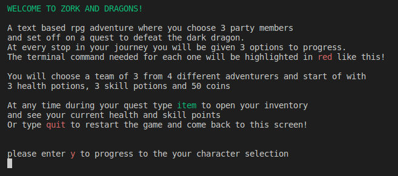
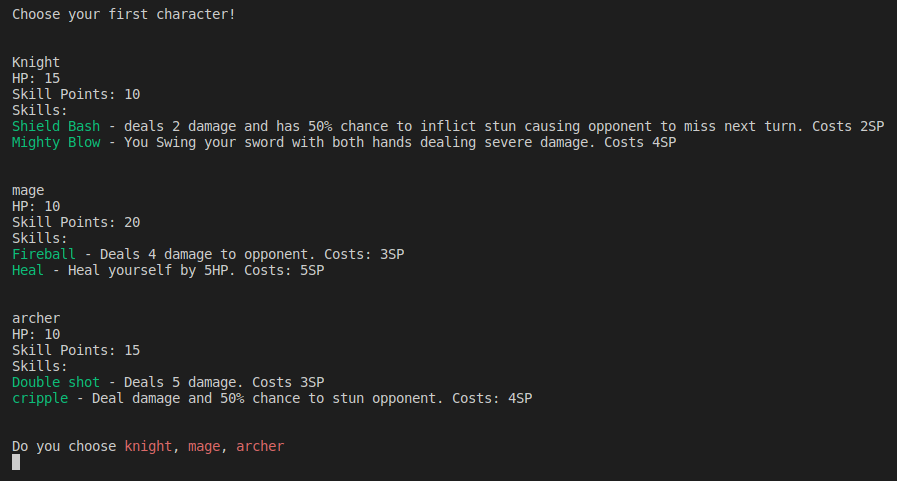
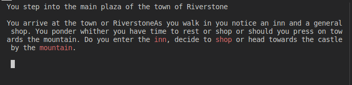
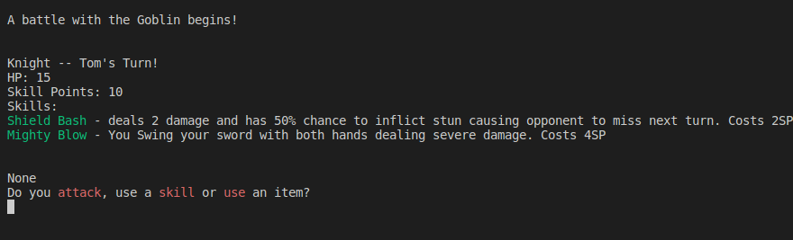
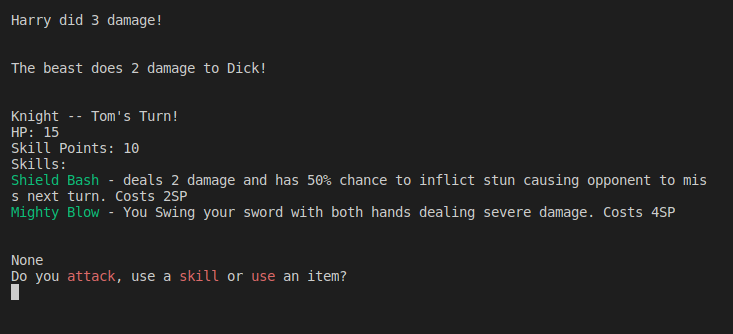

# **ZORK AND DRAGONS**

Zork and dragons is a text based adventure RPG game which literally wears its two biggest influences on its sleeves. Those being [Zork](https://en.wikipedia.org/wiki/Zork) a text based adventure game from the late 70s and the table top game dungeons & dragons.

Made up of two main areas of gameplay. A choose your next step question based system for progression and a turn based battle system. Trying to emulate some of my own favorite games I have tried to incorporate decisions that can lead to avoidance of combat while still advancing. 

The live site is available at [Zork and Dragons](https://zork-and-dragons.herokuapp.com/)

# Features

## Intro and tutorial

The intro screen provides a brief explanation and tutorial for the game. Using the python library "colored" I convey that all valid responses will have their text colour as red. 

## Character select screen 

The screen directly after the intro screen which allows you to pick your parties composition. As a nod to D&D and games like final fantasy its up to you if you go for the usual choice of nice and balanced or try beat the game with 3 archers!

## Adventure section

Here is the main portion of the game. Where all your questing decisions are made and progress happens. At the top will always be what effect your previous choice has had. Directly underneath will be the next part of the adventure which will present you with 3 different choices or paths highlighted with red text.

## Battle system

Once a battle is entered this is the first screen you will see.
It displays all the info for each character as they take their turn going in the order of selection. 

Every character has the choice of using their normal attack, using 1 of their 2 skills or using a potion on themselves.

After all three player characters have taken their turns, whatever monster they are fighting will then attack.

Who dealt the attack, who received and how much damage was done is always displayed after each action. (As seen below)

## Item Screen

This screen is activated by typing item at any stage during your adventure that is outside of battle. It displays your current inventory and your parties current stats and abilities

# Technologies

[Heroku](https://heroku.com) - Used to deploy app to the web

[python](https://python.com) - App written in Python version 3.10.6

I also used multiple python libraries in this apps creation:

- random -- was used to create the 50% chance of the stun mechanic working 

# Deployment

Details on deployment can be found inv the [DEPLOYMENT](./DEPLOYMENT.md) markdown file

Click this [link](https://zork-and-dragons.herokuapp.com/) to view the live heroku hosted application

# Testing

All testing and validation can be found in the [TESTING](./TESTING.md) markdown file.

# Acknowledgements

