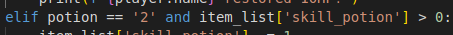

# **TESTING**

You can return to the README.md file [here.](./README.md)

## PEP8 validation

All python files were passed through the CI validator at [pep8ci](https://pep8ci.herokuapp.com) and are all PEP8 compliant.

### Run.py

My run python file shoes no errors

### lists.py

My lists python file shoes no errors

### questions.py

My questions python file shoes no errors

### battle.py

My battle python file shoes no errors

## Error Handling 

The player has 10 unique input instances in this game. In this section I will document all of these, show their potential valid and expected inputs and how my approach to user input error has stopped any possible break in the application.

### Input Prompts

These are the 10 prompts the player will possibly see :

### Intro Prompt:

Only y is accepted as input as seen below:

### Class Prompts:

The player can only choose the three classes available in the input prompt. Using a while loop any other input will start the process again as seen below:
    

### Name Prompts:

As the names are meant to personalized I had no need for error handling here.

### Adventure Prompts:

The main part of the game means there is the most choice here. I use a while loop to come back around if any of the set answers are not given which are the 3 progress answers which are kept in a list and individual to each question, item which will bring you to the item screen and quit which will restart the game. All code snippets seen here below:

### Item Prompt:

This prompts only purpose is to return the player to their last point in the game after viewing their stats. as there is only one possible outcome now error handling was necessary.

### Battle Prompt:

In battle the player is given 3 options attack, skill and use. Instead of using a while loop any input outside of the 3 options causes the players turn function to run again along with an invalid message as seen below:

### Skill Prompt:

The skill menu is handled similarly to the battle prompt with only 2 correct answers and the same error handling as battle as seen below: 

### Use Prompt:

The use menu is handled similarly to the battle prompt with only 2 correct answers and the same error handling as battle as seen below: 

### Gameover Prompt:

## Manual Testing  

Due to the step by step nature of the game and its branching paths most of the testing was done by brute force. Isolating parts of code to test wasn't nearly as useful as I have found with other projects as every decision in this game would carry on and had to carry over its changes into the next segment.

As it is a game I decided to try the game developers approach and try some QA testing by asking 2 friends on mine to run through different builds of the game and see if everything worked/ try purposefully break it. I am quite thankful I did in the end as one friend caught a bug where at one instance where you are supposed to give coins away everything worked fine but one later on in the game it didn't. This ended up being due to the order of a list of strings which I don't think I would have noticed myself.

## Bugs and issues

I am happy to report I had no notable bugs or real issues with this project other than one detailed above in [Manual Testing](#manual-testing). One of the only issues that grinded my progress to a halt was the fact that copying in standard python only creates a reference or a link to the original variable instead of its own instance. Thanks goes to my CI mentor Tim who dug me out of that whole straight away.

Other than that I feel that because my code was simple in structure due to my unfamiliarity with python, it did not leave a huge amount of room for app breaking bugs. I am sure there is much more efficient and cleaner looking ways in python to get the same results but the basic design behind the code structures one definite plus was it kept me away from any huge bugs or issues.

